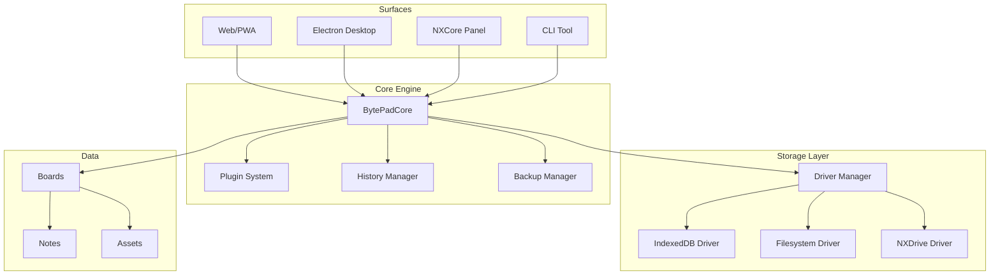

# BytePad Architecture

## Overview

BytePad 3.0 is a multi-surface creative board system built with a decoupled core engine and pluggable storage drivers.

## System Architecture



## Core Components

### BytePadCore

The central engine that manages boards, notes, and operations.

**Responsibilities:**
- Board and note CRUD operations
- Event broadcasting
- Plugin management
- History/undo-redo
- Data validation and sanitization

**Location:** `packages/bytepad-core/src/index.ts`

### Storage Drivers

Abstract storage layer with multiple implementations.

**StorageDriver Interface:**
- **Location:** `packages/bytepad-types/src/index.ts` (single source of truth)
- **Methods:** `load()`, `save()`, `delete()`, `supportsTransactions?()`, `supportsBackup?()`, `healthCheck?()`
- **Consumption:** All apps and drivers import from `bytepad-types`

**Drivers:**
- **IndexedDB**: Browser-based storage (Web/PWA)
- **Filesystem**: Node.js file system (Electron/CLI)
- **NXDrive**: NXCore integration (Panel) - *blocked pending API*

**Location:** `packages/bytepad-storage/src/`

### Driver Manager

Manages driver selection and fallback cascade.

**Fallback Order:** NXDrive → Filesystem → IndexedDB

**Location:** `packages/bytepad-storage/src/driver-manager.ts`

## Data Model

### Board-Centric Architecture

```
Board
├── id: string
├── name: string
├── theme: string
├── notes: Note[]
├── assets: Asset[]
├── playlists: Playlist[]
├── createdAt: number
└── updatedAt: number
```

### Note Structure

```
Note
├── id: string
├── geometry: { x, y, w, h, z }
├── contentHTML: string
├── tags: string[]
├── color: string
├── linkedAssets: string[]
├── createdAt: number
└── updatedAt: number
```

## Surface Implementations

### Web/PWA

- **Framework:** Next.js 13
- **Storage:** IndexedDB (via DriverManager)
- **Features:** PWA, offline support, install prompt
- **Location:** `apps/web/`

### Electron Desktop

- **Framework:** Electron + Next.js
- **Storage:** Filesystem (via DriverManager)
- **IPC:** Bridge wrapper with timeout/retry
- **Location:** `apps/desktop/`

### NXCore Panel

- **Framework:** Next.js (embedded)
- **Storage:** NXDrive (when available) → IndexedDB (fallback)
- **Location:** `apps/web/app/panel/`

### CLI Tool

- **Framework:** Node.js + Commander
- **Storage:** Filesystem
- **Commands:** export, import, flush-sync, doctor
- **Location:** `apps/cli/`

## Plugin System

Plugins extend BytePadCore functionality through event hooks.

**Hook Points:**
- `onRegister`: Plugin registration
- `onInit`: Core initialization
- `onBoardCreate/Update/Delete`: Board lifecycle
- `onNoteCreate/Update/Delete`: Note lifecycle
- `onSync`: Sync events

**Example:** `TagGeneratorPlugin` automatically adds tags based on content.

## IPC Bridge (Electron)

Unified bridge wrapper for Electron IPC operations.

**Features:**
- Timeout handling (5s default)
- Automatic retry (2 attempts)
- Error classification (network, permission, data, unknown)
- Diagnostics and health monitoring

**Location:** `apps/web/lib/bridge.ts`

## Security

- **XSS Protection:** DOMPurify sanitization
- **Validation:** Zod schemas
- **Context Isolation:** Electron security best practices
- **Sandbox:** Electron renderer sandbox enabled

## Performance Optimizations

- **Virtual Scrolling:** Large note lists
- **Debouncing:** Search and filter operations
- **Pagination:** Board/note loading
- **Memoization:** React component optimization

## Testing Strategy

- **Unit Tests:** Vitest for core and storage
- **Integration Tests:** Storage driver behavior
- **E2E Tests:** Playwright for web app
- **Coverage Target:** >80%

## Related Documentation

- [API.md](./API.md) - API reference
- [PLUGIN_GUIDE.md](./PLUGIN_GUIDE.md) - Plugin development
- [DEPLOYMENT.md](./DEPLOYMENT.md) - Deployment guides

